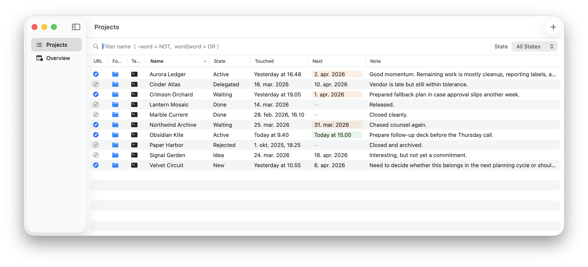
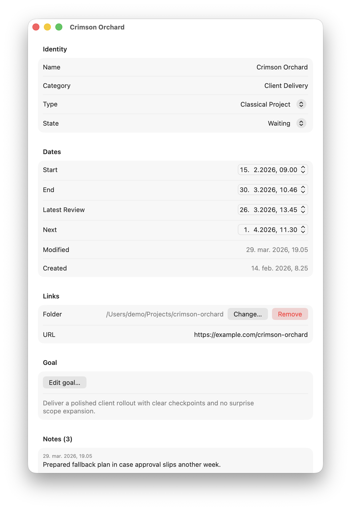
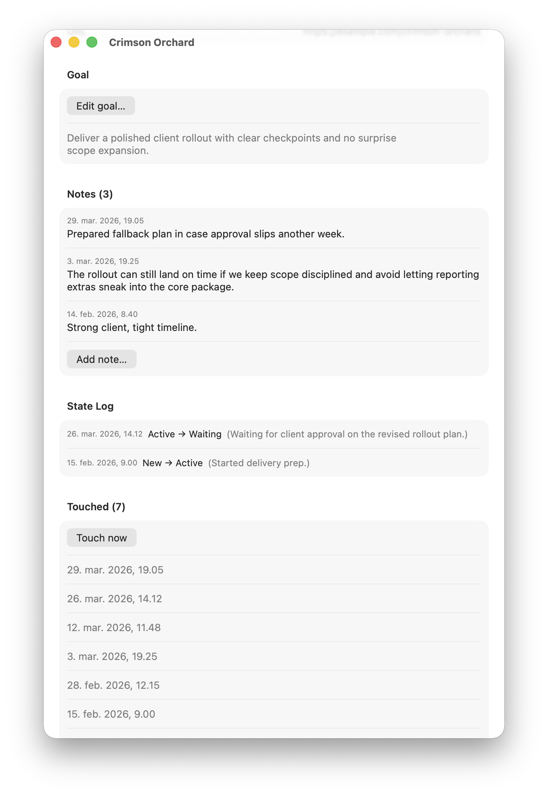
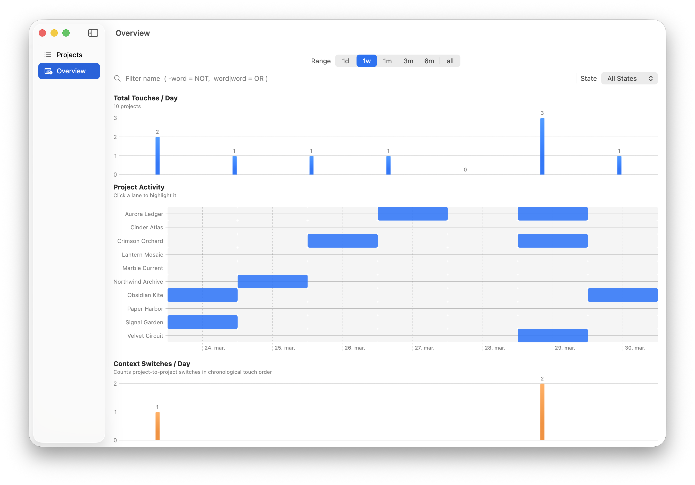

# Project Command And Control

Project Command And Control is a native macOS app for managing projects and areas of responsibility in one place.

It is built for people who need a compact operational view of ongoing work: what exists, what state it is in, what was touched recently, what is waiting, and what needs attention next.

The app uses a simple JSON file for persistence, writes changes immediately, and keeps the interface close to native macOS patterns.

## ⚠ Vibe coding ahead

Human here! This is a vibe-coded project and comes with no guarantees what so ever. Alas, use at your own peril. This project both scratches an itch of mine (I actually need this program in my daily work!) and has helped me explore the domain of AI assisted development.

Everyting up to version 1.3.0 was created during one day


## What It Does

Each project stores a practical working record:

- name, category, type, and state
- state-change log with comments
- start and end dates
- folder and URL links
- notes and touch history
- latest review and next-action date
- goal text

The app currently centers around three views:

1. **Project List View** for fast scanning and editing
2. **Project Property View** for detailed editing of a single project
3. **Overview View** for graphical activity patterns over time

## Screenshots

### Project List View

The list view is the operational control panel. It supports sorting, filtering, inline actions, and direct access to Finder, Terminal, URLs, notes, touch events, and next dates.



### Project Property View

The property view opens as an independent window per project and exposes the full record using native macOS controls.



It is meant to work as the detailed project workspace: notes, dates, review cadence, history, and metadata in one place.



### Overview View

The overview uses Swift Charts to show project activity over time as a per-project swim-lane heatmap. This makes it easier to spot clusters, gaps, frequency of touches, and context switching across projects.



## How It Works

### Data Model

The core entity is a `Project`. A project can be either:

- a **Classical Project**
- an **Area of Responsibility**

Each project is stored in JSON and includes:

- `name`
- `category`
- `projectType`
- `state`
- `log`
- `start`
- `end`
- `modified`
- `created`
- `folder`
- `notes`
- `touched`
- `latestReview`
- `next`
- `url`
- `goal`

Changes are written to disk immediately. There is no separate save step.

### Persistence

The app stores data in a JSON file and reads it on launch. The storage location is configurable from the app’s Settings window using the standard macOS file picker.

This has a few useful consequences:

- the data is transparent and portable
- it is easy to back up
- it is easy to version, transform, or migrate
- the app stays lightweight and local-first

### Project List Workflow

The list view is designed for fast maintenance:

- sort by column
- filter by project name with simple boolean syntax
- filter by state or grouped states
- change state inline
- append touch events
- add notes
- set or clear next dates
- open a project folder in Finder or Terminal
- open the project URL

This makes the list useful not just as an index, but as a daily operating surface.

### Property View Workflow

The property view is the full editor for a project. It opens in its own window, supports immediate persistence, and is intended for slower, more reflective project maintenance.

This is where you work with:

- full metadata
- date fields
- notes
- touch history
- goal text
- folder and URL configuration

### Overview Workflow

The overview is the visual layer on top of project history.

It uses a bucketed time-based heatmap to answer questions such as:

- Which projects have actually been active recently?
- Where are the clusters of work?
- Where are the gaps?
- How often am I changing context?
- Which projects are drawing repeated attention?

The current design combines:

- a top summary strip for total touches per visible time bucket
- a per-project heatmap lane
- a lower strip showing context switches per bucket

## Building And Running

### Requirements

- macOS
- Xcode 26 or newer
- `xcodegen`

### Build

Use the provided build script:

```bash
./build.sh
```

This builds the release app and places it here:

```text
dist/ProjectCommandAndControl.app
```

You can also build Debug:

```bash
./build.sh Debug
```

### Tests

Run the test suite with:

```bash
swift test
```

### Xcode Project Generation

The Xcode project is generated from `project.yml`, so if you add source files you should regenerate it:

```bash
xcodegen generate
```

## Legacy Import And Mock Data

The repository includes a small conversion utility for importing data from an older JSON format:

- [scripts/convert_project_control_center.py](scripts/convert_project_control_center.py)

There is also a publication-safe mock dataset:

- [mock-projects.json](mock-projects.json)

## Development Approach

This project has been developed with substantial help from both **Claude Code** and **Codex**.

That does not mean it was built by prompting without engineering judgment.

The developer comes from a strong software development background, but started this project without prior Swift experience. The AI tools were used as high-leverage collaborators for:

- exploring Swift and SwiftUI patterns quickly
- iterating on app structure and UI behavior
- implementing and refining features
- writing and adjusting tests
- handling repetitive migration and asset work

The important point is that the project direction, product intent, tradeoffs, and technical standards are still developer-led. The tools accelerated the work, but they did not replace software engineering judgment.

## Why This Project Exists

Many project tools are either too heavy, too collaborative, too abstract, or too far removed from the real day-to-day maintenance work of a single person managing many commitments.

Project Command And Control aims for something simpler:

- local-first
- fast to update
- visually informative
- operational rather than ceremonial

It is meant to make project reality visible.
